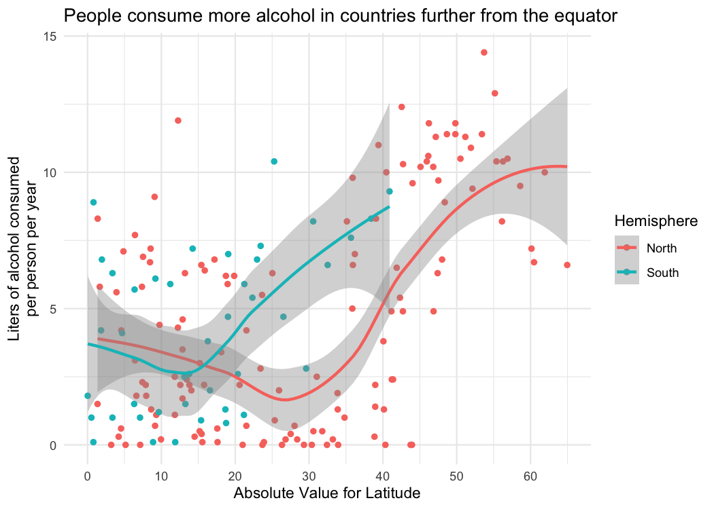
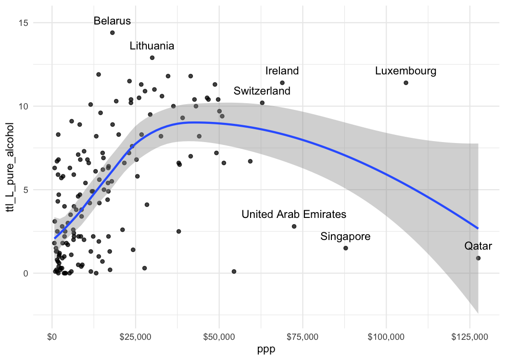
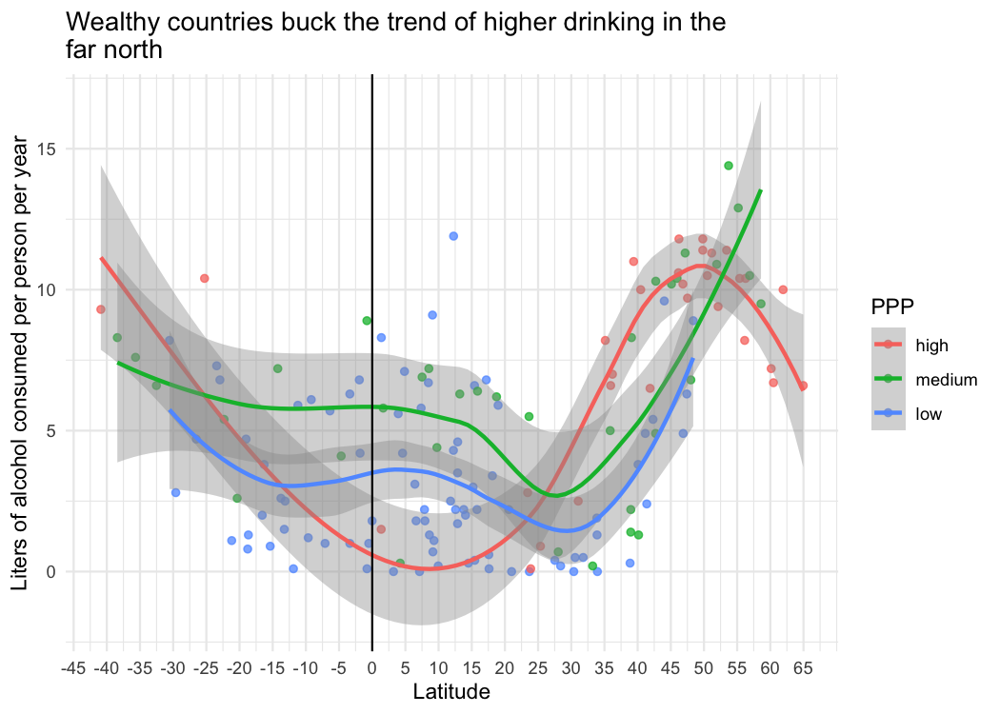
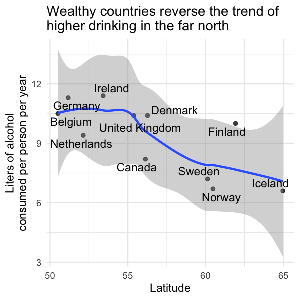

Alcohol consumption as function of latitude and wealth
================
JP
July 7, 2017

# Overview

This script explores global norms of alcohol consumption. I performed
this analysis because I had no idea what alcohol consumption looked like
globally, and I wanted to know.

``` r
library(breadcrumbs)
library(knitr)
library(powerpack)
```

    ## 
    ## Attaching package: 'powerpack'

    ## The following object is masked from 'package:breadcrumbs':
    ## 
    ##     function_template

``` r
library(scales)
library(tidyverse)
```

    ## ── Attaching packages ──────────────────────────────────────────────────────────── tidyverse 1.2.1 ──

    ## ✔ ggplot2 3.2.0     ✔ purrr   0.3.2
    ## ✔ tibble  2.1.3     ✔ dplyr   0.8.3
    ## ✔ tidyr   0.8.3     ✔ stringr 1.4.0
    ## ✔ readr   1.3.1     ✔ forcats 0.4.0

    ## ── Conflicts ─────────────────────────────────────────────────────────────── tidyverse_conflicts() ──
    ## ✖ readr::col_factor() masks scales::col_factor()
    ## ✖ purrr::discard()    masks scales::discard()
    ## ✖ dplyr::filter()     masks stats::filter()
    ## ✖ dplyr::lag()        masks stats::lag()

``` r
source(here::here("file_paths.R"))

theme_set(theme_minimal())
```

Poking around:

``` r
ds_alcohol %>% arrange(desc(ttl_L_pure_alcohol))
```

    ## # A tibble: 193 x 13
    ##    country  beer spirit  wine ttl_L_pure_alco… country_abbr latitude
    ##    <chr>   <dbl>  <dbl> <dbl>            <dbl> <chr>           <dbl>
    ##  1 Belarus   142    373    42             14.4 BY               53.7
    ##  2 Lithua…   343    244    56             12.9 LT               55.2
    ##  3 Andorra   245    138   312             12.4 AD               42.5
    ##  4 Grenada   199    438    28             11.9 GD               12.3
    ##  5 Czech …   361    170   134             11.8 CZ               49.8
    ##  6 France    127    151   370             11.8 FR               46.2
    ##  7 Russia…   247    326    73             11.5 <NA>             NA  
    ##  8 Ireland   313    118   165             11.4 IE               53.4
    ##  9 Luxemb…   236    133   271             11.4 LU               49.8
    ## 10 Slovak…   196    293   116             11.4 SK               48.7
    ## # … with 183 more rows, and 6 more variables: longitude <dbl>,
    ## #   country_code <chr>, indicator_name <chr>, indicator_code <chr>,
    ## #   valid_year <chr>, ppp <dbl>

``` r
ds_alcohol %>% filter(str_detect(country, "R")) %>% arrange(desc(country))
```

    ## # A tibble: 8 x 13
    ##   country  beer spirit  wine ttl_L_pure_alco… country_abbr latitude
    ##   <chr>   <dbl>  <dbl> <dbl>            <dbl> <chr>           <dbl>
    ## 1 Rwanda     43      2     0              6.8 RW              -1.94
    ## 2 Russia…   247    326    73             11.5 <NA>            NA   
    ## 3 Romania   297    122   167             10.4 RO              45.9 
    ## 4 DR Con…    32      3     1              2.3 <NA>            NA   
    ## 5 Domini…   193    147     9              6.2 DO              18.7 
    ## 6 Czech …   361    170   134             11.8 CZ              49.8 
    ## 7 Costa …   149     87    11              4.4 CR               9.75
    ## 8 Centra…    17      2     1              1.8 CF               6.61
    ## # … with 6 more variables: longitude <dbl>, country_code <chr>,
    ## #   indicator_name <chr>, indicator_code <chr>, valid_year <chr>,
    ## #   ppp <dbl>

``` r
ds_alcohol %>% filter(country == "Russian Federation")
```

    ## # A tibble: 1 x 13
    ##   country  beer spirit  wine ttl_L_pure_alco… country_abbr latitude
    ##   <chr>   <dbl>  <dbl> <dbl>            <dbl> <chr>           <dbl>
    ## 1 Russia…   247    326    73             11.5 <NA>               NA
    ## # … with 6 more variables: longitude <dbl>, country_code <chr>,
    ## #   indicator_name <chr>, indicator_code <chr>, valid_year <chr>,
    ## #   ppp <dbl>

``` r
ds_alcohol %>% 
  mutate(
    lat_abs = abs(latitude),
    ns = ifelse(latitude > 0, "North",
      ifelse(latitude <= 0, "South", NA))
  ) %>% 
  filter(complete.cases(ns)) %>% 
  ggplot(aes(x = lat_abs, y = ttl_L_pure_alcohol, color = ns)) + 
  geom_point() + 
  geom_smooth() + 
  scale_color_discrete("Hemisphere") + 
  scale_x_continuous(breaks = seq(0, 80, by = 10)) + 
  labs(
    title = "People consume more alcohol in countries further from the equator",
    x = "Absolute Value for Latitude",
    y = "Liters of alcohol consumed\nper person per year"
  )
```

<!-- -->

``` r
ds_alcohol %>% 
  ggplot(aes(x = latitude, y = ttl_L_pure_alcohol)) + 
  geom_point(alpha = .75) + 
  geom_smooth() + 
  geom_vline(xintercept = 0, color = "green") + 
  scale_color_discrete("Hemisphere") + 
  scale_x_continuous(breaks = seq(-45, 65, by = 5)) + 
  labs(
    title = "Drinking spike is steeper in the northern hemisphere.",
    x = "Latitude",
    y = "Liters of alcohol consumed per person per year"
  )
```

<!-- -->

``` r
ds_alcohol %>% 
  ggplot(aes(x = latitude, y = ttl_L_pure_alcohol)) + 
  geom_boxplot(aes(group = cut_width(latitude, 5))) + 
  scale_x_continuous(breaks = seq(-65, 65, by = 5), limits = c(-65, 65)) + 
  geom_vline(xintercept = 0, color = "blue") + 
  labs(
    title = "Drinking spikes after 30-degrees north of the equator,\n& 15 degrees south",
    x = "Latitude",
    y = "Liters of alcohol consumed per person per year"
  )
```

<!-- -->

``` r
ds_alcohol %>% 
  mutate(country_ppp_60k = ifelse(ppp > 60e3 | ttl_L_pure_alcohol > 12, country, NA)) %>% 
  ggplot(aes(x = ppp, y = ttl_L_pure_alcohol, label = country_ppp_60k)) + 
  geom_point(alpha = .75) +
  geom_smooth() + 
  scale_x_continuous(breaks = seq(0, 150e3, by = 25e3), labels = dollar) + 
  geom_text(nudge_y = .75)
```

<!-- -->

``` r
ds_alcohol %>% 
  filter(ppp < 5e4) %>% 
  ggplot(aes(x = ppp, y = ttl_L_pure_alcohol)) + 
  geom_point(alpha = .75) + 
  geom_smooth() + 
  scale_x_continuous(breaks = seq(0, 150e3, by = 10e3), labels = dollar) + 
  labs(
    title = wrap("Eliminating wealthy outlier countries we see a strong trend of drinking increasing with wealth", 60),
    x = "GDP per Person (PPP) in USD",
    y = "Liters of alcohol consumed per person per year"
  ) 
```

<!-- -->

``` r
ds_alcohol %>% 
  mutate(
    ppp_f = ifelse(ppp <= 15000, "low",
      ifelse(ppp > 15000 & ppp < 30000, "medium",
      ifelse(ppp >= 30000, "high", NA)
    )),
    ppp_f = factor(ppp_f, levels = c("low", "medium", "high"))
  ) %>% 
  filter(complete.cases(ppp_f)) %>% 
  ggplot(aes(x = latitude, y = ttl_L_pure_alcohol, color = fct_rev(ppp_f))) + 
  geom_point(alpha = .75) + 
  geom_smooth() + 
  geom_vline(xintercept = 0, color = "black") + 
  scale_color_discrete("PPP") + 
  scale_x_continuous(breaks = seq(-45, 65, by = 5)) + 
  labs(
    title = wrap("Wealthy countries buck the trend of higher drinking in the far north", 60),
    x = "Latitude",
    y = "Liters of alcohol consumed per person per year"
  )
```

<!-- -->

TBD: Add in religion as a variable.

High PPP countries in northern latitudes driving the plunge in alcohol
consumption:

``` r
ds_alcohol %>% 
  filter(latitude > 50, ppp >= 3e4) %>% 
  ggplot(aes(x = latitude, y = ttl_L_pure_alcohol, label = country)) + 
  geom_point(alpha = .75) + 
  geom_smooth() + 
  geom_text(nudge_x = .25, nudge_y = .25, size = 4) + 
  labs(
    title = wrap("Wealthy countries reverse the trend of higher drinking in the far north", 60),
    x = "Latitude",
    y = "Liters of alcohol\nconsumed per person per year"
  )
```

<!-- -->

``` r
ds_alcohol %>% 
  mutate(
    ppp_f = ifelse(ppp <= 15000, "low",
      ifelse(ppp > 15000 & ppp < 30000, "medium",
      ifelse(ppp >= 30000, "high", NA)
    )),
    ppp_f = factor(ppp_f, levels = c("low", "medium", "high"))
  ) %>% 
  filter(
    complete.cases(ppp_f),
    ppp_f == "high",
    latitude > 50) %>% 
  select(country, ttl_L_pure_alcohol, latitude, ppp) %>% 
  arrange(-ttl_L_pure_alcohol) %>% 
  kable() %>% 
  kableExtra::kable_styling()
```

| country        | ttl\_L\_pure\_alcohol | latitude |      ppp |
| :------------- | --------------------: | -------: | -------: |
| Ireland        |                  11.4 | 53.41291 | 68882.88 |
| Germany        |                  11.3 | 51.16569 | 48729.59 |
| Belgium        |                  10.5 | 50.50389 | 46383.24 |
| Denmark        |                  10.4 | 56.26392 | 49695.97 |
| United Kingdom |                  10.4 | 55.37805 | 42608.92 |
| Finland        |                  10.0 | 61.92411 | 43052.73 |
| Netherlands    |                   9.4 | 52.13263 | 50898.09 |
| Canada         |                   8.2 | 56.13037 | 44025.18 |
| Sweden         |                   7.2 | 60.12816 | 49174.86 |
| Norway         |                   6.7 | 60.47202 | 59301.67 |
| Iceland        |                   6.6 | 64.96305 | 51398.93 |
